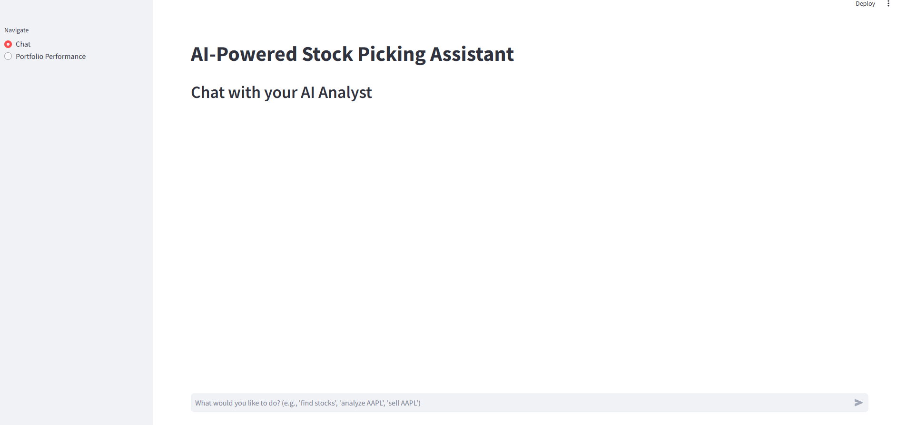

# AI Trading Agent
I was just curious if AI can hallucinate where the market is going.

This application uses Perplexity, GPT-5, QuantiQ.live and Alpaca to find small-cap stocks, provide analysis and recommendations, book orders on these stocks and track the performance of the portfolio. I also added Streamlit for a better user experience. 

## Features
- AI-Driven Stock Discovery: Uses the Perplexity AI API to find interesting micro and small-cap US stocks.

- In-Depth Financial Analysis: Fetches detailed financial data for specific tickers using the Quantiq API.

- Intelligent Recommendations: Employs OpenAI's GPT-4o to analyze the financial data and provide BUY, SELL, or SHORT recommendations with justifications.

- Interactive Chat Interface: A user-friendly chat allows you to request stock ideas and analysis.

- One-Click Trading: Execute recommended trades directly from the chat interface. Trades are executed through the Alpaca API.

- Portfolio Tracking: A dedicated page to view your complete trade history, current holdings, and overall portfolio performance, including value over time.

- Persistent Portfolio: All trades are saved to a local portfolio.csv file, so your data is preserved between sessions.

- Congress trades on specific stocks can be performed through the QuantiQ API.  

## Getting Started
Follow these instructions to get the application running on your local machine.

### Prerequisites
- Python 3.8 or newer

1. Clone or Download the Project
First, ensure you have all the project files (stock_picker_app.py, requirements.txt, portfolio.csv) in a single directory on your computer.

2. Set Up API Keys
This project requires three API keys. You'll need to store them in a .env file for security.

- Create a new file named .env in the same directory as the project files.

- Add your API keys to the .env file in the following format:
```
PERPLEXITY_API_KEY="your_perplexity_api_key_here"
OPENAI_API_KEY="your_openai_api_key_here"
QUANTIQ_API="your_quantiq_api_key_here"
ALPACA_API_KEY="YOUR_PAPER_API_KEY_ID"
ALPACA_SECRET_KEY="YOUR_PAPER_SECRET_KEY"
ALPACA_PAPER="true"
```
PERPLEXITY_API_KEY: Get this from your Perplexity AI account.

OPENAI_API_KEY: Get this from your OpenAI Platform account.

QUANTIQ_API: This is the API key from QuantiQ.live.

ALPACA_API_KEY: This is the API key from Alpaca trading platform

ALPACA_SECRET_KEY: This is the secret key from Alpaca that enables you to perform real trades

ALPACA_PAPER: Switch between the paper (virtual money) or the real Alpaca API

3. Install Dependencies
- Open a terminal or command prompt.

- Navigate to the project directory.

- Install the required Python libraries by running:
```
pip install -r requirements.txt
```
This will install Streamlit, Pandas, Requests, OpenAI, yfinance, and python-dotenv.

4. Run the Application
Once the dependencies are installed and your API keys are set, you can start the Streamlit application.

- In your terminal, make sure you are in the project directory.

- Run the following command:
```
streamlit run stock_picker_app.py
```
Your default web browser will automatically open a new tab with the running application.

## How to Use the App
The application has two main sections, accessible from the sidebar navigation:


### Chat
This is the main interactive page. You can use natural language to ask the AI analyst to perform tasks. Try prompts like:

- "find stocks": The assistant will use Perplexity AI to suggest a list of small-cap tickers.

- "analyze AAPL": The assistant will fetch financial data for the specified ticker (e.g., AAPL), use GPT-4o to analyze it, and provide a recommendation. If the recommendation is actionable (BUY, SELL, SHORT), a button will appear to execute the trade.

- "sell AAPL": If you have a position in the specified ticker, the assistant will ask for confirmation and provide a button to execute the sale.

- "check house and senate trades for {ticker}" - shows all the trades done by Congress officials for that stock.

- "get technicals {ticker}" - calculates the major technical indicators and shows them in nice graphs. 

### Portfolio Performance
This page provides a comprehensive overview of your investment activities. It includes:

- Trade History: A complete table of every transaction you've made.

- Current Holdings: A summary of the stocks you currently own, including the number of shares, current market value, and the unrealized gain or loss.

- Total Portfolio Value: A metric showing the total current market value of all your holdings.

- Portfolio Value Over Time: An area chart visualizing the growth of your portfolio's value since your first trade.

This project is free for everyone. If you'd wish to donate, use the following button:
[☕ Buy me a coffee via PayPal](https://paypal.me/bitheap)
